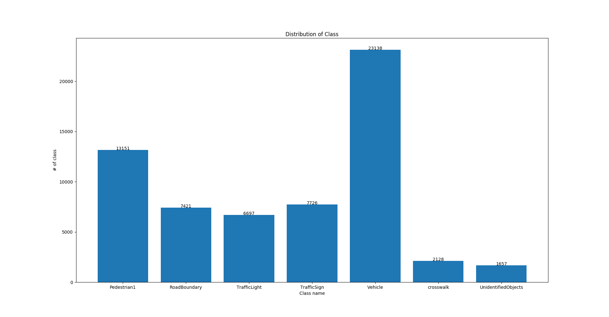
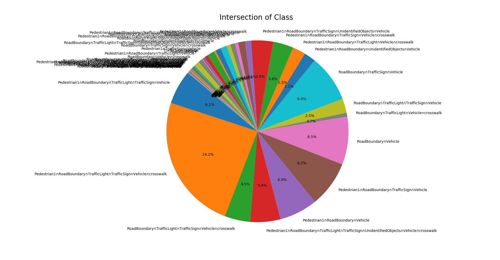
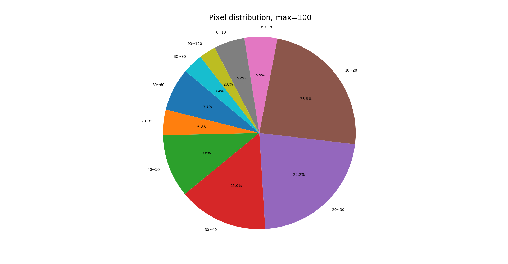

# Image_Statistic
Image statistics


## Requirements
* Python 3.6
* matplotlib

## Precautions
* The "annotations.raf" file should be in the path where main.py is located.

## Usage
If you want to see the distribution of class... (options are case-insensitive)
```bash
python main.py distribution
```

If you want to see the intersection of class... (options are case-insensitive)
```bash
python main.py intersection
```

If you want to see the distribution of pixel... (options are case-insensitive)
* Note that you must also enter the max value next to the "pixel"
* There is no limit to the range of max values.
```bash
python main.py pixel 100
```

## Results
### Distribution


### Intersection


### Pixel


## Author
Junho Kim
